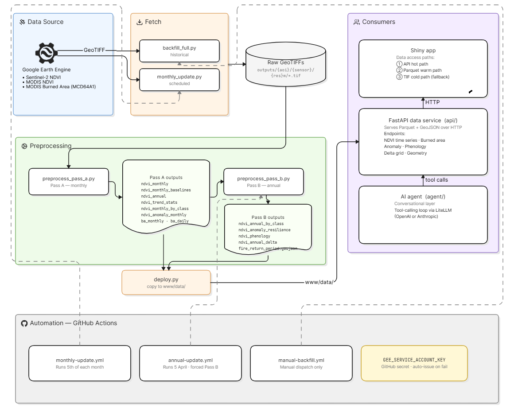

# environmental-ts-data-pipeline

Automated Python pipeline + data service that powers the SensingClues
**environmental-time-series** Shiny app. It fetches satellite imagery from Google
Earth Engine, pre-computes summary tables and analytical products, serves them
over a FastAPI data API, and exposes a natural-language AI agent over the same
data.

**Study areas:** Zambia_Mponda and Zambia_WL (West Lunga). **Sensors:** Sentinel-2
NDVI, MODIS NDVI, MODIS burned area (MCD64A1).

Consumed by the Shiny app at
[github.com/SensingClues/environmental-time-series](https://github.com/SensingClues/environmental-time-series).
Replaces the manual GEE JavaScript workflow (preserved in [reference/](reference/)).

---

## What's in here (end-to-end flow)



Three layers:

1. **Data pipeline** (`pipeline/`, `preprocess/`, `scripts/`) — fetch rasters from
   GEE, then **Pass A** (monthly time-series tables) and **Pass B** (annual derived
   analytics) turn them into Parquet/GeoJSON products.
2. **Automation** (`.github/workflows/`) — GitHub Actions run the pipeline monthly
   and annually with no manual steps.
3. **Data service** (`api/`, `agent/`) — a FastAPI app serves the pre-computed
   products and an AI agent answers questions about them.

---

## Repo structure

```
.
├── config/
│   ├── sites.yaml              # AoIs, sensors, resolutions, data roots
│   ├── phenology_profiles.yaml # Per-class phenology thresholds (Pass B)
│   ├── aoi/                    # AoI boundary GeoJSONs (committed)
│   └── landcover/              # Per-class land cover GeoJSONs (committed)
├── pipeline/                   # GEE fetch + export
│   ├── auth.py                 # GEE auth (interactive OR service account)
│   ├── sentinel2.py            # S2 collection, SCL cloud mask, NDVI
│   ├── modis.py                # MODIS NDVI (quality mask, scaling)
│   ├── burned_area.py          # MCD64A1 BurnDate
│   ├── export.py               # GeoTIFF download + AoI polygon mask
│   └── config.py               # loads config/sites.yaml (repo-relative paths)
├── preprocess/                 # raster → Parquet/GeoJSON products
│   ├── core.py                 # all Pass A + Pass B table computations
│   ├── validate.py             # one-off deep validation vs the app
│   └── verify_outputs.py       # operational checks (schema/range/regression)
├── scripts/
│   ├── backfill_full.py        # full historical fetch (per stage, date-bounded)
│   ├── preprocess_pass_a.py    # Pass A runner
│   ├── preprocess_pass_b.py    # Pass B runner
│   ├── deploy.py               # copy outputs → Shiny app www/data
│   └── monthly_update.py       # orchestrates fetch → Pass A → Pass B → deploy
├── api/                        # FastAPI data service
│   ├── main.py                 # app, routers, /cache/clear
│   ├── cache.py                # thread-safe in-memory response cache
│   ├── dependencies.py         # path/parquet/grid/geometry helpers
│   └── routers/                # health, ndvi, burned_area, geometry
├── agent/                      # AI agent over the data API
│   ├── router.py               # /agent/chat, /agent/providers
│   ├── agent.py                # tool-calling loop
│   ├── tools.py                # tool defs + in-process dispatch
│   ├── llm_client.py           # LiteLLM multi-provider wrapper
│   └── system_prompt.py
├── serve.py                    # combined ASGI app: data API + agent
├── .github/workflows/          # monthly / annual / manual-backfill automation
└── reference/                  # legacy GEE JS scripts (read-only)
```

---

## Getting started

Requires Python ≥ 3.11.

```bash
python -m venv .venv
.venv\Scripts\activate            # Windows  (macOS/Linux: source .venv/bin/activate)
pip install -e ".[dev]"
```

GEE auth — two modes (handled by `pipeline/auth.py`):

- **Local dev:** run `earthengine authenticate` once (interactive credentials).
- **CI / headless:** set `GEE_SERVICE_ACCOUNT_KEY` (the service-account JSON as a
  string); the pipeline uses it automatically.

`config/sites.yaml` defines the AoIs, sensors and resolutions. AoI/land-cover
GeoJSONs are committed under `config/` so the pipeline and API work on any machine.

---

## Data pipeline

### 1. Fetch rasters from GEE

`scripts/backfill_full.py` downloads monthly composites to
`outputs/{aoi}/{sensor}/{res}m/`. It supports an optional bounded date range.

```bash
python -m scripts.backfill_full --stage sentinel2 --dry-run
python -m scripts.backfill_full --stage all
python -m scripts.backfill_full --stage sentinel2 --start-date 2026-04 --end-date 2026-05
```

Stages: `sentinel2` (2019→, 100 m + 1000 m), `modis` (2000→, 250/500/1000 m),
`burned_area` (2000→, 500 m), or `all`.

### 2. Pass A — core monthly time-series tables

Pass A turns the monthly rasters into per-AoI/sensor/resolution Parquet tables.
It is the monthly path (one new month barely shifts history).

```bash
python -m scripts.preprocess_pass_a                       # all AoIs
python -m scripts.preprocess_pass_a --aoi Zambia_Mponda --dry-run
python -m scripts.preprocess_pass_a --force              # recompute existing
```

Outputs (`outputs/processed/{aoi}/{sensor}/{resolution}m/`):

```
ndvi_monthly.parquet                    # AoI-wide monthly mean NDVI
ndvi_monthly_baselines.parquet          # historical min/max/mean per calendar month
ndvi_annual.parquet                     # annual aggregates + completeness flag
ndvi_trend_stats.parquet                # Mann-Kendall trend (annual + seasonal)
ndvi_monthly_by_class.parquet           # per land-cover-class monthly means (Mponda)
ndvi_monthly_baselines_by_class.parquet # per-class 95% CI baselines
ndvi_anomaly_monthly.parquet            # monthly anomaly = mean_ndvi − hist_mean
ba_monthly.parquet                      # burned km² + historical baseline (BA only)
ba_daily.parquet                        # per-day burned km² (BA only)
```

### 3. Pass B — annual derived analytics

Pass B reads Pass A outputs (plus rasters for delta/FRP) and computes the
higher-level products. It is the **annual** path and always does a full recompute,
because adding a year shifts every historical baseline.

```bash
python -m scripts.preprocess_pass_b
python -m scripts.preprocess_pass_b --aoi Zambia_Mponda --dry-run
```

Outputs:

```
ndvi_annual_by_class.parquet            # annual mean + cross-year stats per class
ndvi_anomaly_resilience.parquet         # deficit / recovery / resilience ranking
ndvi_phenology.parquet                  # green-up, peak, senescence (Crops, Rangeland)
ndvi_annual_delta.parquet               # gain/loss km² for all year-pair combos
outputs/processed/{aoi}/burned_area/500m/fire_return_period.geojson
```

### 4. Deploy

`scripts/deploy.py` copies the products into the Shiny app's `www/data/` folder
(`--stage all` / `--dry-run` supported).

### Verification

`preprocess/verify_outputs.py` runs operational checks (TIF sanity, Parquet schema
+ value ranges, and a regression snapshot) used by the monthly automation:

```bash
python -m preprocess.verify_outputs --check all
```

---

## Data automation (GitHub Actions)

`scripts/monthly_update.py` is the single orchestrator the workflows call. It
detects what's new from the output files, fetches only the missing months, runs
Pass A, runs Pass B **only when a new complete year is detected**, verifies, and
(optionally) deploys.

```bash
python scripts/monthly_update.py --dry-run          # show plan, no side effects
python scripts/monthly_update.py --skip-deploy      # full run, skip deploy
python scripts/monthly_update.py --skip-fetch --force-pass-b
```

Workflows in `.github/workflows/`:

| Workflow | Trigger (UTC) | Local time (Netherlands) | Purpose |
|---|---|---|---|
| `monthly-update.yml` | cron 5th @ 06:13 UTC + manual | 5th @ 07:13 CET (winter) / 08:13 CEST (summer) | fetch new month → Pass A → (Pass B if new year) → verify → upload artifacts |
| `annual-update.yml` | cron Apr 5th @ 08:13 UTC + manual | Apr 5th @ 10:13 CEST | forced Pass B once burned-area December data has published (~3-month lag) |
| `manual-backfill.yml` | manual only | — | bounded `backfill_full.py` run for testing/recovery |

Notes:
- Auth uses the `GEE_SERVICE_ACCOUNT_KEY` GitHub secret.
- Both update workflows share one concurrency group so they never overlap.
- A failed run opens a `pipeline-failure` issue automatically.
- Scheduled cron only fires from the **default branch**; manual dispatch works from
  any branch.

---

## Data API (FastAPI)

A read-only service that serves the pre-computed products to the Shiny app (hot
path, `format=table`) and to the AI agent (`format=agent`). No GEE calls — it only
reads `outputs/processed/` and the committed GeoJSONs. Responses are cached in
memory (1 h for time-series, 24 h for geometry).

Run the data API alone, or `serve:app` to include the agent:

```bash
uvicorn api.main:app --port 8000      # data API only
uvicorn serve:app   --port 8000       # data API + /agent
# docs: http://localhost:8000/docs
```

### Endpoints (`/api/v1`)

| Endpoint | Returns |
|---|---|
| `GET /health` | status, data-through month, parquet count, cache stats |
| `GET /available-data` | AoIs, sensors, date ranges, land-cover classes (scanned live) |
| `GET /ndvi/timeseries` | monthly NDVI + baseline + trend |
| `GET /ndvi/by-landcover` | per-class monthly NDVI for a year |
| `GET /ndvi/anomaly` | monthly anomaly + resilience rankings for a year |
| `GET /ndvi/phenology` | green-up / peak / senescence (Crops, Rangeland) |
| `GET /ndvi/annual-grid`, `/ndvi/monthly-grid` | per-pixel NDVI as a compact 2-D grid (Delta Map hot path) |
| `GET /burned-area/summary`, `/burned-area/daily` | monthly km² vs baseline; per-day km² |
| `GET /burned-area/annual-grid`, `/burned-area/monthly-grid` | per-pixel burn frequency / BurnDate grid |
| `GET /geometry/aoi`, `/geometry/landcover`, `/geometry/fire-return-period` | GeoJSON (landcover/FRP support `simplified=`) |
| `POST /cache/clear` | clear the in-memory cache (used after a deploy) |

Common params: `aoi`, `sensor`, `resolution` (`auto` picks the best),
`year`/`month`/`start`/`end`, `format` (`table` | `agent`). Data endpoints share a
consistent envelope (`data`, `metadata`, `status`, `error`).

The **grid** endpoints use a compact 2-D format — 1-D `lats` + 1-D `lons` + a 2-D
`values` matrix (`null` outside the AoI) — ~7× smaller than naive per-pixel JSON.
The `simplified` flag on `/geometry/landcover` Douglas-Peucker-simplifies the large
land-cover polygons (~84% smaller payload), invisible on a Leaflet map.

```bash
curl "http://localhost:8000/api/v1/health"
curl "http://localhost:8000/api/v1/available-data"
curl "http://localhost:8000/api/v1/ndvi/timeseries?aoi=Zambia_Mponda&sensor=modis&resolution=1000&format=agent"
```

### AI agent

`agent/` adds a conversational layer over the same data. `POST /agent/chat` runs a
tool-calling loop (LiteLLM, OpenAI or Anthropic) where each tool maps to a question
the data can answer — time-series, by-class, anomaly, phenology, burned area, fire
return period, land-cover spatial composition, and spatial NDVI change.

```bash
curl -X POST http://localhost:8000/agent/chat -H 'Content-Type: application/json' \
  -d '{"question":"What is the long-term NDVI trend for Mponda?","provider":"openai"}'
```

API keys come from the server environment (`OPENAI_API_KEY` / `ANTHROPIC_API_KEY`)
or the request body (`user_api_key`) — never hard-coded. `GET /agent/providers`
reports which provider keys are configured.

---

## Pixel inclusion rule (`all_touched=False`)

Per-class NDVI statistics mask each monthly raster to the land-cover polygon using
rasterio's default `all_touched=False` — only pixels whose **center** falls inside
the polygon are included. This is more conservative than R terra's default and
avoids edge contamination from adjacent classes.

**Consequence:** small classes (Bare_ground, Flooded_vegetation, Water) may have no
valid pixels at coarse resolution (1000 m, ~1 km²/pixel), so they're excluded from
per-class stats there — expected, not a bug. To force full coverage, set
`all_touched=True` in `compute_ndvi_monthly_by_class()` in `preprocess/core.py`
(trades edge contamination for completeness).

---

## Legacy reference

The original GEE JavaScript scripts are preserved in [reference/](reference/). See
[reference/README.md](reference/README.md) for context and a known SCL masking bug
the Python pipeline corrects.

## Author / contact

Felicity Shiyu Fan — sfan289@aucklanduni.ac.nz
SensingClues environmental monitoring project
